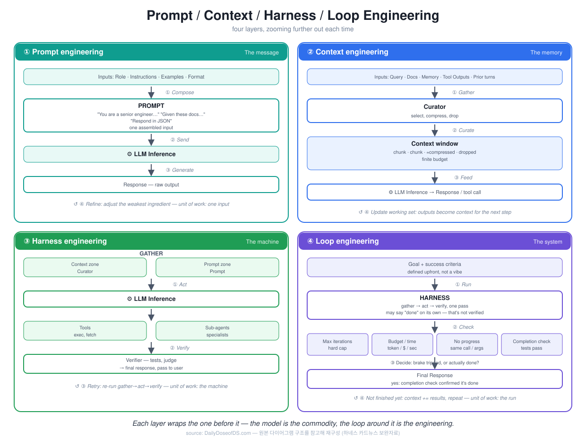
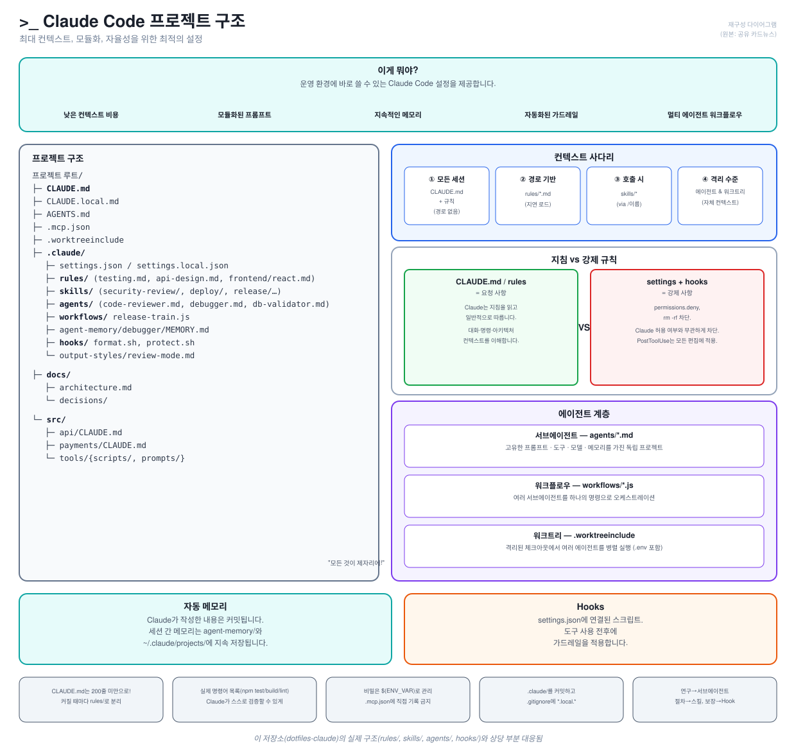

# Agent Harness 설계 — AI 자기개선의 현실적인 경로

Lilian Weng의 글을 Minho Hwang이 10장 카드뉴스로 정리한 내용(2026-07-14 공유)을 요약·보존한 문서. 하네스(harness)는 이 저장소가 다루는 대상(rules/skills/agents/hooks) 그 자체이므로, 개념을 정리해두고 이후 규칙을 다듬을 때 참고한다.

## 핵심 메시지

> 가중치(모델 자체)보다 먼저, AI는 자신을 둘러싼 실행 시스템(harness)을 더 잘 설계하고 스스로 개선하는 방향으로 발전할 가능성이 크다.

기반 모델(능력) + 실행 시스템(하네스) = 실제 작업 성능. 하네스는 계획/반복, 도구 호출, 컨텍스트, 파일/기억, 평가/검증, 권한을 아우르는 모델 둘레의 실행·운영 계층이며, 단순 프롬프트도 에이전트 이름표도 모델 가중치도 아니다.

## 10장 요약

| 장 | 제목 | 요지 |
|---|---|---|
| 1 | HARNESS 개요 | 가중치보다 하네스 설계·자기개선이 현실적 경로. 하네스란 무엇인지, 어떻게 최적화되는지, 어떻게 스스로 개선하는지가 이 글의 3가지 질문 |
| 2 | 하네스란 무엇인가 | 계획/반복·도구 호출·컨텍스트·평가/검증·권한·파일/기억을 결정하는 계층. 단순 프롬프트·에이전트 이름·모델 가중치가 아님 |
| 3 | 반복 루프 | 계획→실행→관찰/테스트→분석→수정→재시도의 6단계. One-shot 답변과 달리 실패를 학습해 목표 달성까지 반복 |
| 4 | 파일 기반 장기 기억 | 대화 컨텍스트(일시적)를 넘어 파일 시스템(영구적)을 기억으로 사용. 실험 로그·코드 변경·오류 기록·TODO를 구조화해 저장 |
| 5 | 서브에이전트·백그라운드 작업 | 메인 에이전트가 검색/코드/실험/요약을 서브 에이전트에 병렬 위임. 속도 향상, 역할 분리, 재현 가능한 협업 |
| 6 | 최적화 대상의 확장 | 프롬프트 → 구조화된 컨텍스트 → 워크플로 → 하네스 코드 → 최적화 코드로 개선 범위 확대. ACE(플레이북 업데이트)·MCE(검색/선택 최적화)·Meta-Harness(하네스 자체 탐색) |
| 7 | 워크플로도 설계 대상 | 아이디어→코드→실험→분석→논문→검토 흐름 자체도 탐색 대상. 수동 설계 vs ADAS/AFlow 같은 자동 탐색 |
| 8 | Self-Harness | 실패 사례 수집→근본원인 파악→편집 허용 영역만 수정→held-out 테스트→회귀 검사→채택/폐기의 안전한 자기수정 루프. 약한 모델은 자기개선이 오히려 악화될 수 있음 |
| 9 | 진화적 탐색이 잘 맞는 이유 | 설계 공간이 이산적이고 조합이 많으며 실행 결과로 점수화 가능. AlphaEvolve·Darwin Gödel Machine 예시. 가중치까지 함께 최적화하는 건 아직 초기 단계 |
| 10 | 남은 과제·실무 포인트 | 평가자 불명확성, 기억 수명주기, 실패 기록 부족, 다양성 붕괴, 리워드 해킹 등 미해결. 실무 교훈: 프롬프트보다 실행 루프·평가 설계 우선, 대화보다 파일 기반 상태 관리, 평가자·권한은 루프 밖에 |

## 보완 개념 — 4계층 엔지니어링

DailyDoseofDS.com 자료로 보완. 하네스는 프롬프트·컨텍스트를 감싸는 한 겹이고, 루프는 그 하네스를 감싸는 바깥 겹이라는 관점:

1. **Prompt engineering** — 메시지 하나 조합
2. **Context engineering** — 대화가 아니라 관리되는 기억(큐레이션·유한 예산)
3. **Harness engineering** — LLM + 도구 + 서브에이전트를 감싼 기계 (Gather→Act→Verify)
4. **Loop engineering** — 목표·완료 기준을 정의하고 하네스를 반복 실행할지 판단하는 바깥 시스템 (Max iterations·Budget·No-progress·Completion check)

## 이 저장소와의 접점

`dotfiles-claude`는 이미 하네스 개념 일부를 구조로 구현하고 있다.

| 카드뉴스 개념 | 이 저장소의 대응 |
|---|---|
| 파일 기반 장기 기억 (4장) | `docs/`, `docs/specs/`, `CHANGELOG.md`, `agent-memory/` |
| 서브에이전트·백그라운드 위임 (5장) | `agents/*.md`, `workflows/*.js` |
| 워크플로 자체도 설계 대상 (7장) | `workflows/` (여러 서브에이전트를 하나의 명령으로 오케스트레이션) |
| 평가자·권한은 루프 밖에 (10장) | `hooks/` — `permissions.deny`, `PreToolUse` 차단은 모델의 판단과 무관하게 강제 적용 |
| Self-Harness 안전한 편집 원칙 (8장) | `CLAUDE.md`의 "요청 내용은 다음에도 적용되도록 CLAUDE.md에 업데이트" 규칙과 직접 관련 |

## 다음 단계 (이번 범위 밖)

8장 "Self-Harness"의 안전한 편집 원칙(큰 재작성보다 작은 수정, 편집 범위 제한, 실패한 수정도 기록)을 `rules/work-behavior.md`에 반영할지는 이후 별도 세션에서 검토한다. 이번에는 지식을 문서로 남기는 데까지만 진행.

## 출처

- Lilian Weng, HARNESS 원문
- Minho Hwang, 카드뉴스 정리 (Facebook, 2026-07-13)
- DailyDoseofDS.com, "Prompt / Context / Harness / Loop Engineering" (보완자료)
