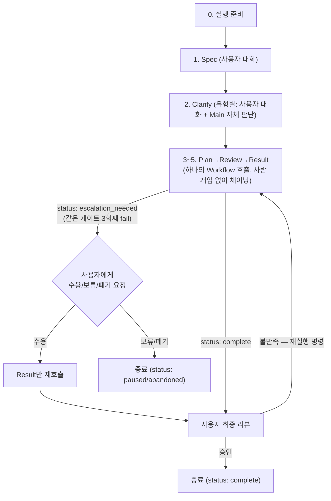

# Ship-Discussion

논쟁적·모호한 주제를 구조화된 5단계(spec→clarify→plan→review→result)로 정리해 결론을 도출하는
파이프라인. spec/clarify는 사용자와 직접 대화로, plan/review/result는 서로 다른 사고도구를 가진
에이전트들이 협의해서 진행한다. 사용자가 개입하는 주요 지점은 다음과 같다:

1. spec/clarify — 사용자와 직접 대화 (단, clarify의 일부 쟁점은 Main이 자체 판단 — 아래 2단계 참조)
2. Review 게이트가 같은 지점에서 2회 초과 fail(3회째)하면 수용/보류/폐기 결정 요청 (드물게만 발생)
3. result가 끝난 최종 결론을 사용자가 리뷰
4. 불만족 시 재실행 명령

Plan→Review→Result는 사람이 매 단계 판단할 필요가 없는 규칙 기반 진행(게이트 통과/조건부/fail,
3회 초과 시 에스컬레이션, 전부 해결되거나 5라운드)이라 **하나의 `Workflow` 호출로 체이닝**된다 —
라운드마다 "계속할까요?"를 묻지 않고 끝까지 자동으로 돈다 (아래 3~5단계 참조).

전역 스킬이므로 **어느 프로젝트에서 호출되든** 그 프로젝트의 현재 디렉터리 기준으로 동작한다.
결과물은 `docs/rfc/{NNNN}-{slug}/`에 쌓인다 (`docs/rfc/README.md` 참조).

## 실행 아키텍처

- **spec, clarify**: 이 SKILL.md가 같은 대화 세션 안에서 사용자와 직접 주고받는다 — 다회 왕복이
  필요하므로 Agent 도구로 위임하지 않는다. (clarify의 유형2 쟁점만 예외 — Main이 사용자 없이
  자체 판단한다.)
- **plan, review, result**: `Workflow` 도구를 `name: 'ship-discussion-panel'`,
  `args: {stage: 'pipeline', ...}`로 호출한다 (`name`과 `args`는 분리된 파라미터 — 워크플로 스크립트
  내부에서 쓰는 `workflow()` 헬퍼 문법과 다르다, 아래 3~5단계 참조). 이 워크플로가 `agents/
  ship-discussion-technique-agent.md`, `agents/ship-discussion-position.md`, `agents/
  ship-discussion-synthesizer.md`를 조합해 에이전트끼리 협의시킨다. **`stage: 'pipeline'` 한 번의
  호출이 Plan→Review(fail시 재작업 루프, 최대 2회)→Result(라운드 반복, 최대 5회)까지 전부 체이닝해서
  수행한다** — 이 구간엔 사용자에게 되물을 게 규칙적으로 정해져 있지 않은 부분이 없어서(3회 초과
  fail만 예외) 워크플로 안에서 끝까지 돌 수 있다. 3회 초과 fail만 `status: 'escalation_needed'`로
  조기 반환해 Main이 사용자에게 묻는다. (디버깅용으로 `stage: 'plan'|'review'|'result'` 개별 호출도
  남아있다.)
- **Workflow 호출은 비동기다**: 호출 즉시 결과가 오지 않고 task-id만 반환되며, 실제 결과는 나중
  turn에 task-notification으로 도착한다. Main은 호출 직후 사용자에게 "OO 단계 진행 중" 정도만
  안내하고, notification이 도착하면 그 결과로 해당 단계 파일을 작성한 뒤 다음 단계로 진행한다 —
  호출 직후 결과를 안다고 가정하지 않는다.

## 원칙

- **아티팩트 = 진실 원천**: 단계를 넘어갈 때 Main은 직전 대화 기억에 기대지 않고, 그 시점까지 쌓인
  `output_dir`의 파일(`1-spec.md`~`5-result.md`, 상태 파일)을 다시 읽어 상태를 복원한다. (참고:
  `/clear`로 컨텍스트를 강제로 비우는 방식도 검토했으나, 스킬은 스스로를 `/clear`할 수 없고 — 그건
  사용자가 세션에 직접 내리는 명령이다 — Plan/Review/Result는 애초에 `Workflow`의 `agent()` 호출이
  Main의 대화 이력을 물려받지 않는 격리된 컨텍스트에서 시작하므로 이 규율이 필요 없다. Spec/Clarify만
  이 규율을 따로 지킨다.)
- **게이트 우회 금지**: 미달 상태를 "대략 괜찮음"으로 넘기지 않는다. 단계 생략 제안은 거부한다.
  통과 기준을 실제로 충족했는지 확인하지 않고 다음 단계로 진행하지 않는다.

## 프로세스



## 0단계: 실행 준비

1. 사용자의 1차 문제 제기에서 주제를 영문 kebab-case로 요약해 `topic-slug` 생성
2. 순차 번호 계산: `docs/rfc/`를 스캔해 `NNNN-*` 폴더 중 가장 큰 번호 +1 (없으면 `0001`):
   ```bash
   mkdir -p docs/rfc
   max=$(find docs/rfc -maxdepth 1 -type d -regex '.*/[0-9][0-9][0-9][0-9]-.*' \
     | sed -E 's#.*/([0-9]{4})-.*#\1#' | sort -n | tail -1)
   next=$(printf '%04d' $((10#${max:-0} + 1)))
   ```
3. `output_dir = docs/rfc/${next}-{topic-slug}` 생성, 상태 파일 생성:
   ```bash
   mkdir -p .claude/state "$output_dir"
   cat > .claude/state/ship-discussion-active.json <<EOF
   {"output_dir": "$output_dir", "status": "in-progress", "current_stage": "spec", "pending_workflow_stage": null}
   EOF
   ```
   - `current_stage`: 지금 진행 중인 단계 (`spec`|`clarify`|`pipeline`|`result`) — `pipeline`은
     Plan~Result 체이닝 구간 전체를 가리킨다 (내부적으로 뭘 하고 있는지는 `Workflow` 쪽 진행 상황
     화면(`/workflows`)에서 본다)
   - `pending_workflow_stage`: Workflow 호출을 보내고 그 결과(task-notification)를 기다리는 중이면
     그 stage 이름(`pipeline` 또는 디버깅용 `result` 등), 기다리는 게 없으면 `null` — 세션이
     압축되거나 재개돼도 "지금 뭘 기다리던 중이었는지" 이 필드로 복원한다
   - `status`: `in-progress` | `complete` | `paused`(에스컬레이션에서 "보류") | `abandoned`

**템플릿은 여기서 한꺼번에 복사하지 않는다** — 각 단계는 그 단계 진입 시(해당 파일이 아직 없을
때만) 자신의 템플릿을 직접 복사한다 (Plan~Result는 한 번에 체이닝되므로 3~5단계 템플릿은 그 진입
시점에 함께 복사 — 아래 3~5단계 참조). 파일명은 원본과 동일하게 번호를 유지한다
(`output_dir/1-spec.md`, `2-clarify.md`, `3-plan.md`, `4-review.md`, `5-result.md`) — 아직 시작
안 한 단계의 파일이 미리 생기지 않고, `ls` 정렬 순서가 파이프라인 순서와 일치한다.

## 1단계: Spec — 사용자와 대화 (루프)

1. 이 단계 최초 진입 시(`output_dir/1-spec.md`가 없으면) 템플릿 복사:
   ```bash
   cp <스킬 base directory>/templates/1-spec.md "$output_dir/1-spec.md"
   ```
2. 사용자의 1차 문제 제기를 원문 그대로 "## 원 문제 제기"에 기록

**기법**: `mind-mapping` → `how-might-we` → `first-principles` 로테이션. **루프 엔지니어링**
(`docs/agent-harness-design.md`의 Loop 계층 — Max iterations·Budget·No-progress·Completion check)을
그대로 적용한다. 자세한 절차는 `stages/1-spec.md` 참조.

3. **라운드 반복**: 매 라운드 로테이션에서 다음 기법 2~3개를 한 번에 적용해, 그 질문들을
   `AskUserQuestion` 한 호출의 `questions` 배열(최대 4개)에 담아 동시에 제시한다 — 라운드마다
   여러 번 왕복하지 않고 한 번의 호출·응답으로 그 라운드를 끝낸다. 예상 답변 방향을 옵션으로
   제시하되 사용자는 항상 자유 답변(Other)도 고를 수 있다. 답변을 받으면: 새 쟁점이 나왔는지,
   기존 쟁점이 보강됐는지 판단 → 정체 카운터 갱신(새 것 없으면 +1, 있으면 0) → "## 라운드 로그"에
   기록 (이때 "라운드"는 AskUserQuestion 호출 1회다)
4. 각 쟁점마다 "이게 왜 쟁점인가?"를 반드시 채운다
5. **종료 조건** (아래 하나라도 충족 시 루프 종료):
   - 쟁점 3~5개 확보 **그리고** 정체 카운터 2 이상 (Completion check / No-progress)
   - 8라운드 도달 (Max iterations 안전장치 — 이 경우 쟁점이 3개 미만이면 사용자에게 직접 정리 요청)
6. **구조화 보강**: 측정 가능한 성공/판정 기준, 범위 포함/제외, 이해관계자(R/A/C/I)를 채운다.
   확정 못 지은 항목은 지어내지 말고 `[NEEDS CLARIFICATION: 질문]`으로 표시 — red-flag 탐지 목록과
   함께 2단계로 넘어간다. 자세한 내용은 `stages/1-spec.md` 참조
7. **Self-Review 게이트**: 7축(완결성/명료성/구현가능성/테스트가능성/일관성/스코프/YAGNI)으로
   findings에 심각도 태깅 + red-flag 단어 스캔. 판정에 따라:
   - Sound → 2단계로
   - Needs work → 지적된 쟁점만 재작성 (최대 2회)
   - Major issues → 사용자에게 직접 개입 요청
   red-flag 탐지 목록은 2단계로 넘겨 우선순위로 쓴다. 자세한 절차·7축 표는 `stages/1-spec.md` 참조

## 2단계: Clarify — 유형별 분기 (유형1은 사용자 대화, 유형2는 Main 자체 판단)

1. 이 단계 최초 진입 시(`output_dir/2-clarify.md`가 없으면) 템플릿 복사:
   ```bash
   cp <스킬 base directory>/templates/2-clarify.md "$output_dir/2-clarify.md"
   ```

**쟁점 선정**: Spec Self-Review의 red-flag 탐지 목록 + `[NEEDS CLARIFICATION]` 목록에 있는 쟁점부터
우선 다룬다. 여기에 Clarify 자체의 **모호어 탐지**("개선","빠르게","충분히" 등)로 새로 찾은 것도
더한다 (자세한 목록은 `stages/2-clarify.md` 참조).

**유형 판정** (쟁점마다 대화 시작 전에 먼저): 각 쟁점을 아래 둘 중 하나로 분류한다.

- **유형1 (사용자 고유 의도)** — "사용자가 정확히 무슨 뜻으로 이 쟁점을 썼는가"는 사용자 본인만
  답할 수 있다. `socratic-method`로 사용자와 직접 대화한다.
- **유형2 (내적 일관성)** — "이 쟁점이 다른 쟁점·전제와 모순되지 않는가"는 Main이 논리적으로
  판단 가능하다. 사용자에게 묻지 않고 Main이 직접 함의 도출·반례 검토까지 수행한다.

판단 기준: 쟁점 문구가 사용자만 아는 배경지식·의도·선호를 요구하면 유형1, 이미 확보된 정보(spec의
다른 쟁점, 지금까지의 답변)만으로 논리적 검증이 가능하면 유형2. 애매하면 유형1로 취급한다(안전한
쪽으로 — 잘못 넘겨짚는 것보다 한 번 더 묻는 게 낫다).

**유형1 처리**: `stages/2-clarify.md`의 socratic-method 절차(명료화 질문→함의 도출→반례 제시→
재정의/aporia)를 그대로 따른다. 질문은 `AskUserQuestion`으로 **한 번에 하나씩만** 던진다 — 1단계와
달리 여기선 배치하지 않는다. 다음 질문이 직전 답변에 따라 달라지는 적응적 대화라 배치하면 성립하지
않기 때문 (자세한 이유는 `stages/2-clarify.md` 참조 — 지난 라운드의 배치 결정을 Clarify에 한해
되돌린 것).

**유형2 처리**: Main이 쟁점의 함의를 스스로 추적하고, 다른 쟁점·전제와의 충돌 여부를 검토해
결론(일관됨 / 재정의 필요 / 모순 발견)을 낸다. 이 결론은 사용자에게 새로 대화를 열지 않고, 유형1
쟁점을 순차로 다루는 흐름 중 적절한 지점에 "이렇게 정리했습니다, 맞나요?" 확인 질문 하나로 끼워
넣어 승인만 받는다 (억지로 묶지 않는다).

**에스컬레이션**: 유형2를 처리하다가 "쟁점 자체가 아니라 spec의 전제가 잘못됐다"는 결론에 이르면,
승인 확인으로 넘기지 않고 즉시 사용자와의 라이브 대화로 전환한다 (1단계 Spec으로 돌아가는 흐름과
동일하게 다룬다 — spec을 다시 짜야 하는 문제이기 때문).

2. 확인된 내용(재정의/aporia/유형2 판단)을 "## 쟁점별 명확화"에 기록
3. **게이트**: 쟁점마다 유형 판정이 이뤄졌는지, 유형1 쟁점 중 최소 1개는 socratic-method 절차를
   실제로 끝까지 거쳤는지 확인 (전부 유형2로 분류돼 사용자 대화가 아예 없으면 안 된다 — 최소
   1개는 유형1이어야 함)
4. **Coverage 게이트**: socratic-method 대화가 끝나면(방법론과 다른 층위의 별도 확인) 스코프/경계·
   예외/한계 상황·제약·트레이드오프·용어 정의·완료 신호 5개 범주를 Clear/Partial/Missing으로
   스캔한다. Missing이 남으면 그 범주만 socratic-method로 한 라운드 더 — 전부 Clear/Partial이어야
   3단계로 진행 가능. 자세한 범주 표는 `stages/2-clarify.md` 참조
5. 통과하면 3단계로

## 3~5단계: Plan→Review→Result — 하나의 workflow로 체이닝

Plan 이후부터는 "다음에 뭘 할지"가 전부 정해진 규칙(게이트 통과/조건부/fail, 3회 초과 시
에스컬레이션, 전부 해결되거나 5라운드)으로 결정되고 사람이 매 단계 개입할 필요가 없다 — 그래서
`Workflow`를 3번 따로 부르지 않고 **`stage: "pipeline"`로 한 번에 체이닝**한다 (내부적으로 Plan→
Review(fail시 재작업, 최대 2회)→Result(라운드 반복, 최대 5회)를 전부 수행). 유일한 예외(같은 게이트
3회째 fail)만 워크플로가 조기 반환해 Main이 사용자에게 묻는다.

1. 이 단계 진입 시(파일이 아직 없으면) 3~5단계 템플릿을 한 번에 복사한다 — 여기서부터 사용자
   개입 없이 끝까지 진행되므로 lazy-copy를 단계별로 쪼갤 필요가 없다:
   ```bash
   cp <스킬 base directory>/templates/3-plan.md "$output_dir/3-plan.md"
   cp <스킬 base directory>/templates/4-review.md "$output_dir/4-review.md"
   cp <스킬 base directory>/templates/5-result.md "$output_dir/5-result.md"
   ```
2. `Workflow` 도구를 아래 파라미터로 호출한다 (`name`과 `args`는 도구의 분리된 두 파라미터 —
   워크플로 스크립트 안에서 쓰는 `workflow('이름', {...})` 헬퍼 문법을 그대로 도구 호출에 옮기면
   `args`가 전달되지 않아 크래시한다):
   ```
   name: "ship-discussion-panel"
   args: {
     stage: "pipeline",
     issues: <spec.md + clarify.md의 쟁점 목록>,
     context: <주제 + 배경>,
     slug: <output_dir의 {NNNN}-{topic-slug}>
   }
   ```
3. 호출 직후 결과가 오지 않는다 (비동기) — 사용자에게 "Plan~Result 진행 중"이라고만 안내하고,
   상태 파일의 `pending_workflow_stage`를 `"pipeline"`으로 갱신한다
4. task-notification으로 결과가 도착하면 `pending_workflow_stage`를 `null`로 되돌리고, 반환된
   `status`로 분기한다

> **워크플로 실행 이름에 대해**: `Workflow`의 `meta.name`은 스크립트에 고정된 literal이라 실행마다
> RFC 슬러그로 바꿀 수 없다 — 대신 위 `args.slug`를 워크플로가 실행 시작 직후 `log()`로 가장 먼저
> 찍고, 내부 에이전트 라벨에도 붙여서 `/workflows`에서 실행을 열어보면 바로 어느 RFC인지 식별
> 가능하게 한다 (최상위 실행 목록 자체의 이름은 여전히 고정이다 — 이건 도구 제약이라 못 바꾼다)

### `status: "escalation_needed"` (같은 게이트 3회째 fail)

`steel-man` 정성 검증 + synthesizer 정량 루브릭 채점(게이트 점수 0~100)의 하이브리드 판정이 같은
게이트에서 3회째도 fail이면(CRITICAL 있음 or 점수<60), 워크플로가 그 시점의 plan/review 내용을
그대로 담아 반환한다. Main은:
1. `output_dir/3-plan.md`, `output_dir/4-review.md`에 지금까지의 시도 내역을 기록
2. `AskUserQuestion`으로 사용자에게 **수용(현재 계획으로 강행) / 보류(다음에 재검토) / 폐기(이
   논의 중단)** 중 하나를 요청
3. 수용 → 워크플로를 `stage: "result"`로 재호출해 이 계획 그대로 Result 진행 (아래 5단계 출력 참조)
4. 보류 → 상태 파일 `status`를 `"paused"`로 기록하고 세션 종료, 사용자가 다시 요청하면 이어서 진행
5. 폐기 → 상태 파일 `status`를 `"abandoned"`로 기록하고 종료

### `status: "complete"` (Plan→Review 통과/조건부통과 → Result까지 전부 진행됨)

1. `output_dir/3-plan.md`: `plan.synthesis`를 그대로 기록 (대안·평가기준 포함)
2. `output_dir/4-review.md`: `review.verdict`를 그대로 기록 — 판정이 조건부 통과였다면 이월표도 함께
3. `output_dir/5-result.md`: `resolved`(해결된 쟁점)와 `unresolved`(라운드 5회 넘도록 안 풀린 쟁점,
   `aporia`가 아니라 "미해결 — 최대 라운드 도달"로 표기)를 가지고 아래 6단 구조를 작성한다 (에이전트
   결과를 있는 그대로 반영 — Main이 임의로 결론을 바꾸지 않는다):
   1. **배경 (goal/scope)**: spec.md의 원 문제 제기 + 범위 포함/제외 요약
   2. **현재**: spec/clarify에서 확인된 현재 상황
   3. **문제점**: 현재 상황이 왜 문제인가 (spec의 "왜 쟁점인가" + clarify로 명확화된 것)
   4. **고민한 내용**: 쟁점별 대안 A/B 비교의 **정리된 결론**(장단점 비교, 근거) — 라운드별 논쟁
      전문이 아니다. `unresolved`에 남은 쟁점은 "결론: 미해결 — 사유"로 남긴다
   5. **결정**: 채택한 대안 + 왜 이게 나은지
   6. **참고/주의사항**: 가정, 재검토 조건, 잔여 리스크(필요시만), 미해결 쟁점 목록, 사인오프(승인자:
      사용자, 상태)
4. 사용자에게 최종 결론 전체를 보여주고 `AskUserQuestion`으로 승인을 요청한다 (개입 지점 ③)
5. **자가 게이트 점검**: 모든 쟁점이 resolved거나 미해결 사유가 명시됨, "결정"이 검토 내용에 근거함,
   "고민한 내용"이 논쟁 전문이 아니라 정리된 결론만 담김
6. 승인되면 상태 파일을 갱신하고 종료:
   ```bash
   tmp=$(mktemp)
   jq '.status = "complete"' .claude/state/ship-discussion-active.json > "$tmp" \
     && mv "$tmp" .claude/state/ship-discussion-active.json
   ```
7. **불만족 — 재실행 명령 (개입 지점 ④)**: 사용자가 "다시 해줘"류로 명령하면, 피드백 내용에 따라
   `stage: "result"`(라운드 추가) 또는 `stage: "pipeline"`(Plan부터 재작업)으로 다시 부른다.
   `status`는 `in-progress`로 유지

자세한 각 단계 내부 절차(기법 구성, 판정 기준, 출력 포맷)는 `stages/3-plan.md`, `stages/4-review.md`,
`stages/5-result.md`에 그대로 있다 — 호출 방식만 하나로 합쳐졌을 뿐 각 단계가 하는 일 자체는
바뀌지 않았다. 디버깅이 필요하면 `stage: "plan"` / `"review"` / `"result"`로 개별 호출도 가능하다
(`workflows/ship-discussion-panel.js` 참조).

**훅으로 강제하지 않는다** — Stop 훅은 "사용자 응답을 기다리는 정상 턴"과 "진짜 종료"를 구분할 방법이
없고(exit 2가 사용자 입력을 기다리는 게 아니라 Claude를 강제로 계속 응답하게 만들어 오히려 위험하다),
그래서 시도했다가 걷어냈다. 대신 이 SKILL.md의 자가 게이트 점검만으로 규율을 지킨다 — 사용자 최종
승인 전에 스스로 세션을 끝내지 않는다. 사용자가 중간에 그만두길 원하면 그렇게 하도록 두고, `status`를
`"abandoned"`로 기록한다.

## Common Mistakes

| 실수 | 올바른 방법 |
|------|-----------|
| spec/clarify를 에이전트에게 위임 | 사용자와 직접 대화 — 다회 왕복 필요 (clarify 유형2는 예외) |
| spec/clarify/result 확인 질문을 평문으로 던짐 | `AskUserQuestion` 도구로 던진다 — 질문·답변이 구조적으로 구분된다 |
| Spec 질문을 라운드마다 하나씩 개별 호출 | Spec은 여러 질문을 `AskUserQuestion` 한 호출의 `questions` 배열에 배치 (발산 로테이션이라 질문 간 독립적) |
| Clarify 유형1 질문을 여러 개 한 호출에 배치 | Clarify는 한 번에 하나씩 순차로 — 다음 질문이 직전 답변에 의존하는 적응적 대화라 배치가 안 통함 |
| clarify의 모든 쟁점을 사용자와 대화 | 유형2(내적 일관성)는 Main이 직접 판단, 유형1(사용자 고유 의도)만 대화 |
| 템플릿 5개를 0단계에서 한꺼번에 복사 | 각 단계 진입 시(파일 없을 때만) 그 단계 템플릿만 번호 유지한 채 복사 |
| `workflow('이름', {...})` 표기를 문자 그대로 도구 호출로 사용 | 실제 `Workflow` 도구는 `name`/`args`가 분리된 파라미터, 비동기 호출 |
| Workflow 호출 직후 결과를 안다고 가정 | task-notification 도착까지 대기, 그동안 사용자에겐 진행 안내만 |
| 사용자 승인 전에 세션을 스스로 끝냄 | 자가 게이트 점검으로 규율 유지 (Stop 훅으로 강제하지 않음 — 강제하면 오히려 사용자 입력 없이 계속 응답하게 돼 위험) |
| plan/review/result를 Main이 혼자 처리 | 반드시 workflow로 에이전트 협의 |
| result 라운드를 무한 반복 | 워크플로 내부에서 자동 반복하되 최대 5라운드 상한은 지킨다 (라운드마다 사용자 확인은 없음 — Plan~Result 전체가 사람 개입 없는 구간이기 때문) |
| Plan/Review/Result를 3번 따로 `Workflow` 호출 | `stage: "pipeline"` 한 번으로 체이닝 (개별 호출은 디버깅용으로만) |
| synthesizer 결과를 Main이 임의로 수정 | 에이전트 판정을 그대로 반영, 다르면 이유 명시 |
| result.md에 라운드별 논쟁 전문을 누적 기록 | 고민 과정은 워크플로 실행 중에만, 문서엔 쟁점별 최종 결론만 |
| `output_dir` 밖에 실행 산출물 저장 | `docs/rfc/{NNNN}-{slug}/`에만 저장 |
| `.claude/state/`를 git에 커밋 | 실행 중에만 존재하는 임시 파일 — `.gitignore`에 추가 |
