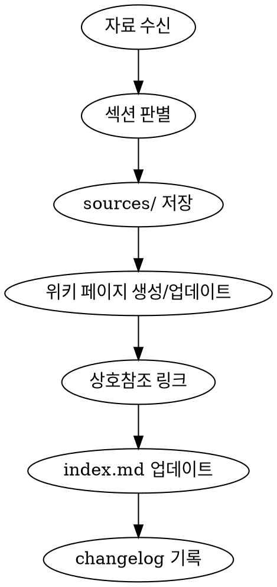

# Wiki Ingest

원본 자료를 읽고 위키 페이지로 변환하는 프로세스.

## Wiki 루트

`/Users/woobs/Repository/llm_wiki/LLM_Wiki`

모든 경로는 이 루트 기준. 어떤 프로젝트에서든 이 절대 경로로 접근한다.

## 프로세스



## 단계별 규칙

### 1. 도메인 판별
- 자료 내용을 보고 `me/` 또는 `sre/` 중 적절한 도메인 선택
- 모호하면 사용자에게 확인

### 2. 원본 저장
- 링크: `sources/{도메인}/` 에 `YYYY-MM-DD-제목.md`로 원문 저장
- 텍스트: 동일 형식으로 저장
- 파일: 그대로 `sources/{도메인}/`에 복사
- **원본은 절대 수정하지 않음**

### 3. 위키 페이지 생성/업데이트 (1 소스 → 다수 페이지)
하나의 소스에서 여러 유형의 페이지를 생성/업데이트한다:

| 유형 | 설명 | 파일명 예시 |
|------|------|-----------|
| **source** | 원본 요약 (1:1) | `2026-04-23-google-sre-book.md` |
| **entity** | 도구, 기술, 사람 | `prometheus.md` |
| **concept** | 원칙, 방법론 | `sli-slo-sla.md` |
| **comparison** | 비교 분석 | `prometheus-vs-datadog.md` |
| **synthesis** | 종합 통찰 | `monitoring-strategy-overview.md` |

- `wiki/{도메인}/`에 개념당 하나의 `.md` 파일
- 파일명: `kebab-case.md`
- 기존 페이지에 추가할 내용이면 업데이트, 새 개념이면 신규 생성
- Obsidian `[[위키링크]]` 형식으로 관련 페이지 상호 참조

### 4. index.md 업데이트
- **`wiki/index.md`** (단일 카탈로그)에 도메인별 → 유형별로 추가
- 각 항목에 한 줄 설명 포함

### 5. Changelog 기록
- `log/changelog.md`에 날짜, 동작, 영향받은 페이지 기록

## 사고 도구 호출

Ingest는 **📋 ORGANIZE → 📤 PRODUCE** 흐름 ([[wiki/me/4-cases/index]] 참조). 다음 시점에 사고 도구를 호출한다:

| 시점 | 도구 | 행동 |
|------|------|------|
| 카테고리·페이지 분류 결정 | [[wiki/me/thinking-tools/mece]] | "이 분류가 겹치지 않고 빠짐없는가?" 자가 점검 |
| 대안 카테고리 위치를 고민 중일 때 | [[wiki/me/thinking-tools/steel-man]] | 채택 안 한 위치의 장점을 강하게 정리 후 비교 |
| 기존 위키 내용과 모순 (긴장) | [[wiki/me/thinking-tools/5-whys]] | 모순의 근본 원인 추적 → 콜아웃에 기록 |
| 큰 synthesis 페이지 작성 | [[wiki/me/thinking-tools/first-principles]] + [[wiki/me/thinking-tools/pre-mortem]] 한 단락 | 가정 의심 + "이 합성이 6개월 후 틀렸다면?" |
| commit 직전 (changelog 기록 전) | [[wiki/me/thinking-tools/rubber-duck]] | 변경 요약을 외부에 설명하듯 풀어쓰며 누락 점검 |

상세 가이드는 LLM_Wiki/CLAUDE.md의 "사고/출력 기법" 섹션.

## 위키 페이지 템플릿

```markdown
# 제목

관련: [[관련-페이지1]], [[관련-페이지2]]

## 요약
핵심 내용 1-3줄

## 상세
본문 내용

## 출처
- 원본 경로 또는 URL
```

## Common Mistakes

| 실수 | 올바른 방법 |
|------|-----------|
| 원본 수정 | sources/는 불변 |
| index.md 업데이트 누락 | 항상 index에 링크 추가 |
| changelog 미기록 | 매 인제스트마다 기록 |
| 하나의 페이지에 여러 개념 | 개념당 하나의 페이지 |
