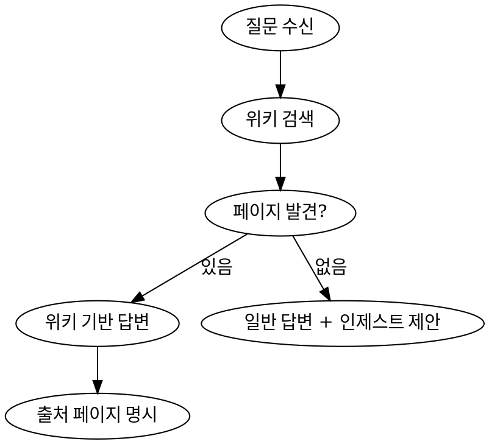

# Wiki Query

위키에 축적된 지식을 검색하고 답변하는 프로세스.

## Wiki 루트

`/Users/woobs/Repository/llm_wiki/LLM_Wiki`

모든 경로는 이 루트 기준. 어떤 프로젝트에서든 이 절대 경로로 접근한다.

## 프로세스



## 규칙

### 검색 순서
1. `wiki/index.md`를 먼저 읽어 관련 페이지 파악
2. 해당 페이지를 읽고 내용 기반으로 답변
3. 필요시 Grep으로 추가 검색
4. 답변 끝에 참조한 위키 페이지 경로 표시

### 위키에 없을 때
- 일반 지식으로 답변
- "이 내용을 위키에 추가할까요?" 제안

### 답변 형식
```
[답변 내용]

📖 참조: [[페이지1]], [[페이지2]]
```

짧은 답변·요약은 [[wiki/me/thinking-tools/prep]] 형식 권장 — Point → Reason → Example → Point. `wiki/index.md` 한 줄 설명도 PREP 1문 압축형.

## 질문 유형별 사고 도구

Query는 **🔍 THINK 중심** ([[wiki/me/4-cases/index]] 참조). 질문 유형에 따라 사고 도구를 호출한다:

| 질문 유형 | 도구 | 답변 흐름 |
|---------|------|----------|
| "왜 이렇게 됐지?" / "근본 원인이 뭐지?" | [[wiki/me/thinking-tools/5-whys]] | "왜?"를 반복해 표면 답에서 멈추지 않기 |
| "기존 답이 맞나?" / "다들 왜 이렇게 하지?" | [[wiki/me/thinking-tools/first-principles]] | 가정 분해 → 기본 사실 → 재구성 |
| "옵션·종류·분류가 뭐가 있지?" | [[wiki/me/thinking-tools/mece]] | 겹치지 않고 빠짐없는 분류로 답변 |
| "이 결정이 좋은가?" / "그때 결정이 옳았나?" | [[wiki/me/thinking-tools/decision-review]] | 결과≠결정. 결정 시점 정보로 합리성 평가 |
| "X 하면 어떻게 망할까?" | [[wiki/me/thinking-tools/inversion]] | 역방향 사고 — 회피해야 할 것 나열 |
| 짧고 명료한 답이 필요 | [[wiki/me/thinking-tools/prep]] | Point → Reason → Example → Point |

상세 가이드는 LLM_Wiki/CLAUDE.md의 "사고/출력 기법" 섹션.

## Common Mistakes

| 실수 | 올바른 방법 |
|------|-----------|
| 위키 안 보고 바로 답변 | 항상 위키 먼저 검색 |
| 출처 페이지 미표시 | 참조한 페이지 명시 |
